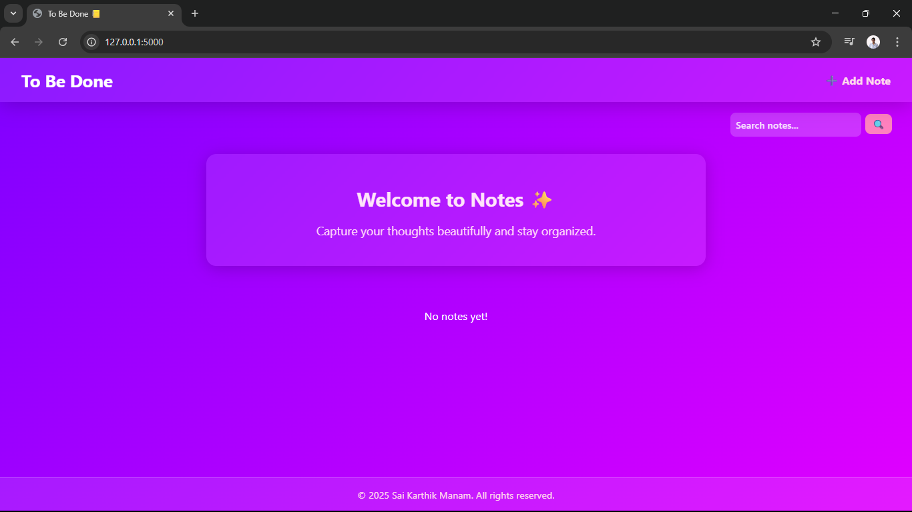
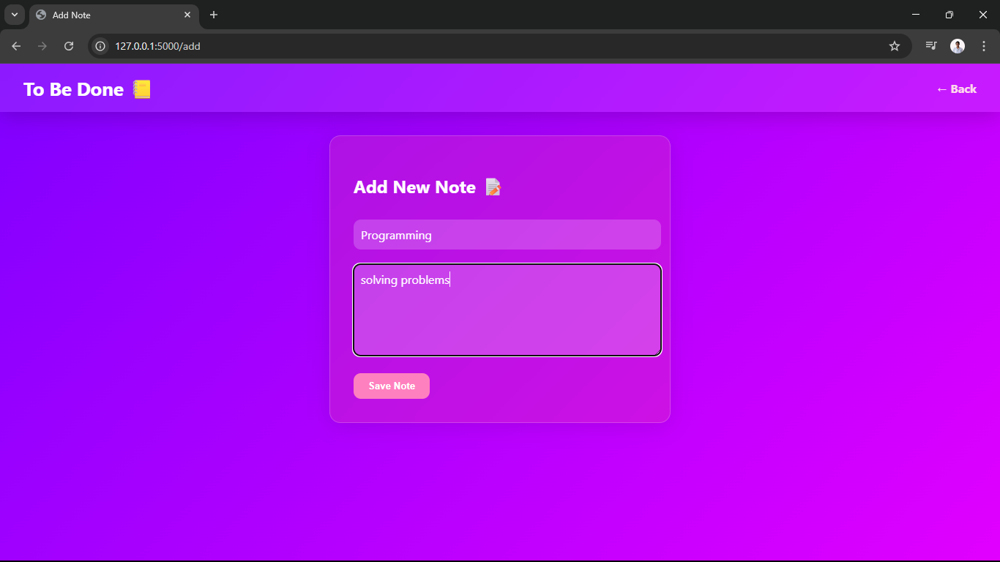
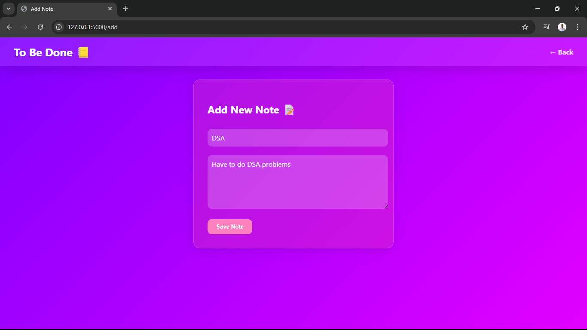
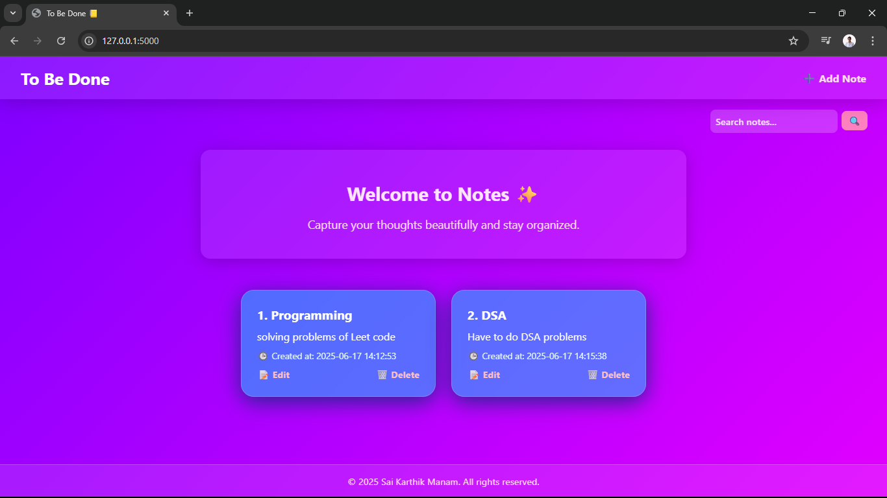
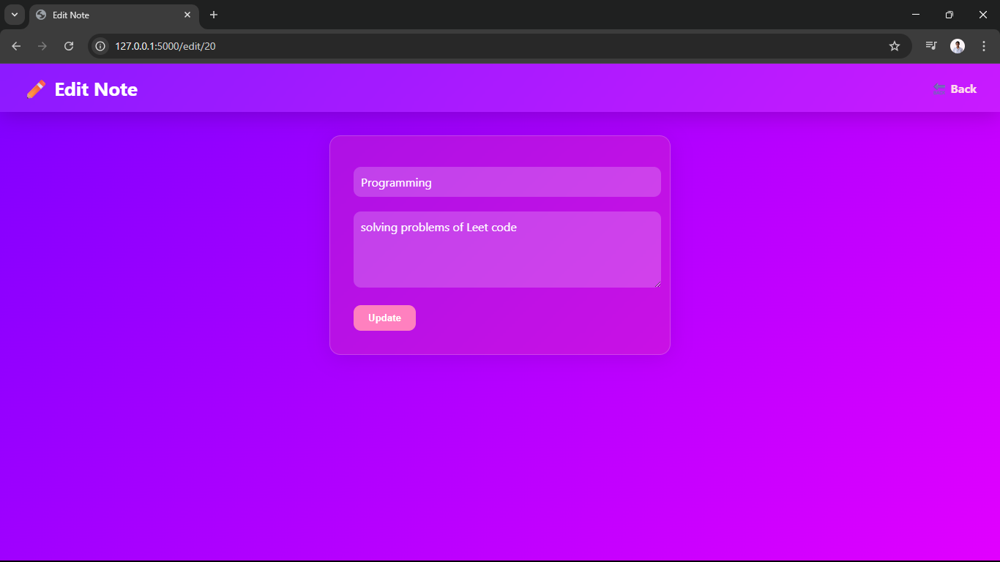
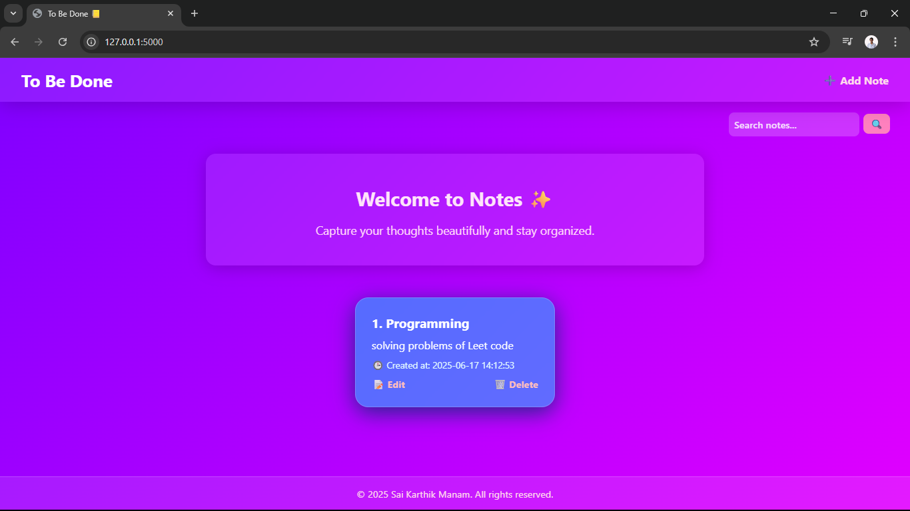

# 📝 TODO App - Flask + MySQL
Let's take a minute to note our reminders

A beautiful and simple **To-Do Note-Taking App** built using **Flask**, **MySQL**, and **HTML/CSS**. Organize your thoughts, capture notes, and manage your tasks seamlessly.

---

## 🚀 Features

- ✅ Add, Edit, and Delete Notes
- 🔍 Search notes by title or content
- 📱 Responsive and modern UI
- 🗂️ Notes sorted by creation date
- 🛢️ MySQL database integration

---

## 📸 Screenshots

